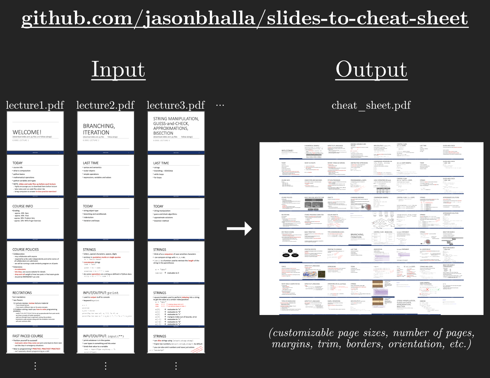

# slides-to-cheat-sheet: Convert Lecture Slides → Cheat Sheet / Reference Sheet

This script combines multiple lecture slide PDFs into one output PDF cheat sheet / reference sheet.

In some university classes, you are allowed to bring a "cheat sheet" to an exam, where you can put any notes you want. You can use this script to automatically build a "cheat sheet" that places all slides from any inputted slideshows on the sheet, as big as possible while still fitting them all.



## Step 1: What to Add

Ensure these core files are in the main folder, `slides-to-cheat-sheet`:

- `generate_sheet.py`
- `config.json`

In `input/`, add your lecture slide PDFs, for example:
  - `lecture1.pdf`
  - `lecture2.pdf`
  - `lecture3.pdf`
  - etc.

## Step 2: What to Edit

Open `config.json` and set the values you want.

### What Each Setting Means

- `output_pages`  
  How many pages the final output PDF should have.

- `output_page.width_in`, `output_page.height_in`  
  The size of each output page, in inches.  
  Example: `11.0` by `8.5` for landscape letter.

- `output_page.margins_in.left`, `bottom`, `right`, `top`  
  The outer margins on the final output pages, in inches.

- `slide.width_units`, `slide.height_units`  
  The slide aspect ratio.  
  Use:
  - `16` and `9` for most modern slides
  - `4` and `3` for older slides

- `trim_pt.left`, `bottom`, `right`, `top`  
  How much to crop off each slide **before** placing it in the output.
  For example, if all slides have the same extra whitespace, you may want to trim it to allow the content to be bigger.
  Units are **points**.  
  `72 points = 1 inch`.  
  Use `0` if you do not want any cropping.

- `offset_pt.x`, `offset_pt.y`  
  Shifts the whole slide grid on the output page.  
  Usually leave these at `0` unless you need to nudge the layout.

- `latex.paper_size`  
  Usually leave as `"custom"`.

- `latex.landscape`  
  `true` for landscape pages, `false` for portrait.

- `latex.frame`  
  `true` draws borders around slides.  
  Usually leave as `false`.

- `latex.column_major_order`  
  If `true`, slides are placed **top to bottom, then left to right**.  
  Usually leave this as `true`.

- `latex.delta_pt.x`, `latex.delta_pt.y`  
  Space between slides, in points.  
  Use `0` and `0` for no extra gap.

- `cleanup`  
  If `true`, temporary files like `.log` and generated `.tex` are deleted after the script runs.

## Step 3: How to Run

Open Terminal, go into the folder, and run:

```bash
python3 generate_sheet.py <output_file_name.pdf> [<input_file_1.pdf> ...]
```

- `generate_sheet.py` is the script that you run.
- `<output_file_name.pdf>` is the file name to use for the outputted PDF cheat sheet, that will appear in `output/` (along with a file called `combined.pdf` which is simply all input slides combined into one PDF).
- If you want to specify specific files (or a specific order of the files) in `input/` to be used in the output, list the file names (e.g. `<input_file_1.pdf> <input_file_2.pdf> ...`). You can also not specify any input files, in which case all PDFs in `input/` will automatically be used (in file order).

## Examples of Usage

### Example 1
#### Example (to create `output/cs_101_cheat_sheet.pdf` using the slides from `lecture1.pdf`, `lecture2.pdf`, `lecture3.pdf` in that order):
- First, place `lecture1.pdf`, `lecture2.pdf`, `lecture3.pdf` in `input/`.
- Next, customize parameters (if desired) in `config.json`.
- Then, run:
```bash
python3 generate_sheet.py cs_101_cheat_sheet.pdf lecture1.pdf lecture2.pdf lecture3.pdf
```
After you run the script, `output/` will contain:
- `cs_101_cheat_sheet.pdf`, which is your cheat sheet containing all the slides from `input/lecture1.pdf`, `input/lecture2.pdf`, `input/lecture3.pdf` in that order
- `combined.pdf`, which is just all the slides from `input/lecture1.pdf`, `input/lecture2.pdf`, `input/lecture3.pdf` in that order combined into one PDF (without formatting adjustments).

### Example 2
#### Example (to create `output/cs_101_cheat_sheet.pdf` using the slides from all the PDFs you put in `input/`):
- First, place all the slide PDFs you want to use in `input/`.
- Next, customize parameters (if desired) in `config.json`.
- Then, run:
```bash
python3 generate_sheet.py cs_101_cheat_sheet.pdf
```
After you run the script, `output/` will contain:
- `cs_101_cheat_sheet.pdf`, which is your cheat sheet containing all the slides from `input/` in file order
- `combined.pdf`, which is just all the slides from `input/` in file order combined into one PDF (without formatting adjustments).
